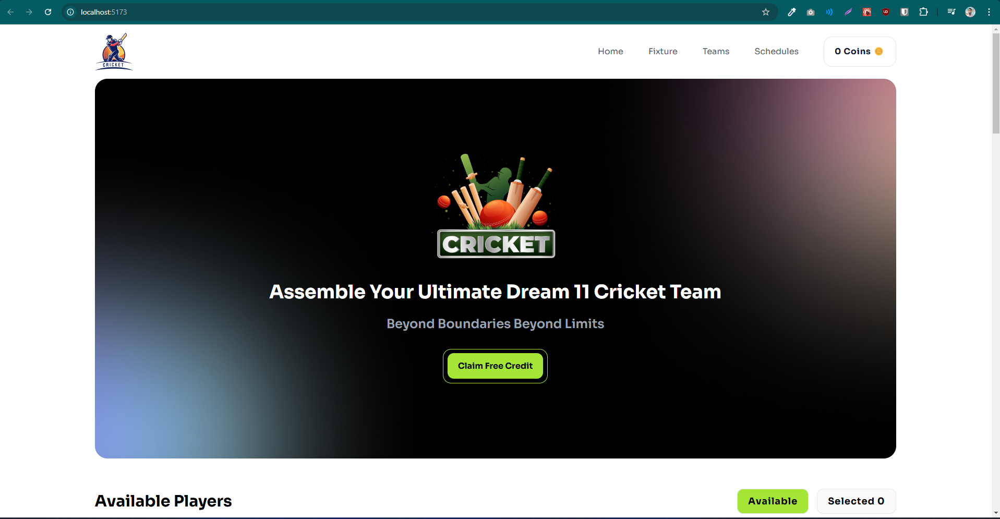

# BPL Dream 11

### Overview of the website

### Description

BPL Dream 11 is a dynamic cricket team website focused on the Bangladesh Premier League. Built using React, it showcases team line-ups, player profiles, match schedules, and real-time stats. Fans can explore in-depth player insights and team strategies. The platform is designed to deliver an interactive experience for BPL enthusiasts, allowing them to track their favorite teams. With user-friendly navigation and updated content, BPL Dream 11 offers a comprehensive hub for cricket lovers in Bangladesh.

### Uses Technologies

- Tailwind CSS
- React
- React Icons
- React-Toastify
- Git & Github
- Vercel for deploying

### Key Features

- Free coins added.
- Conditional toggle button (Available and Selected).
- Player selection system added to the selected container.
- Only one player can be added at a time.
- Maximum of 6 players can be added.
- Player removal system added.

 

#### [Repository Link](https://github.com/programming-hero-web-course1/b10a7-dream-11-shamsuttabriz)

#### [Live Link](https://st-bpl-dream-11.netlify.app/)
